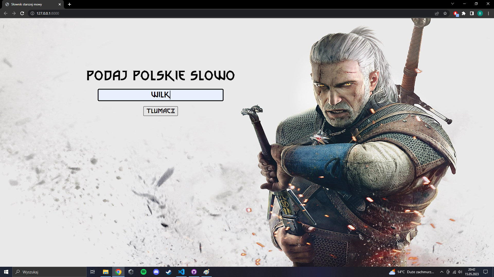
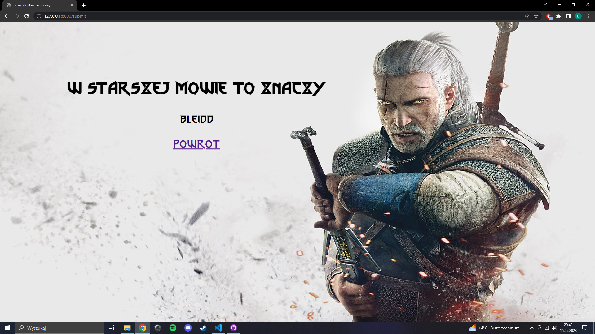

# Słownik starszej mowy 

Interface in Polish lang

## Opis

Słownik internetowy wykorzystujący bazę danych MySQL oraz FastAPI, który po wprowadzeniu polskiego słowa wyszukuje jego odpowiednik w starszej mowie z Wiedźmina. Aplikacja składa się z backendu w FastAPI oraz frontendu w React.

## Licencja

Aplikacja działa na licencji MIT

---

## Uruchamianie przez Docker (lokalnie)

Najprostszy sposób — wymaga tylko Dockera:

```bash
git clone https://github.com/0lch4/Slownik_starszej_mowy.git
cd Slownik_starszej_mowy
```

Stwórz plik `.env` na podstawie `.env.example`, następnie:

```bash
docker compose up --build
```

Aplikacja będzie dostępna pod adresem:
- Frontend: `http://localhost:80`
- Backend API: `http://localhost:8000`

---

## Wdrożenie na AWS EC2

Zawartość pliku `ec2-setup.sh` wklej jako **User Data** podczas tworzenia instancji EC2:

**EC2 → Launch Instance → Advanced Details → User Data**

Skrypt automatycznie zainstaluje Docker, pobierze obrazy z Docker Hub i uruchomi aplikację.

Wymagane porty w Security Group:
- **22** — SSH
- **80** — HTTP (frontend)

---

## Instalacja lokalna (bez Dockera)

Wymagany serwer [MySQL](https://dev.mysql.com/downloads/mysql/) oraz narzędzie `poetry`.

```bash
git clone https://github.com/0lch4/Slownik_starszej_mowy.git
cd Slownik_starszej_mowy
pip install poetry
poetry install
poetry shell
```

Stwórz plik `.env` na podstawie `.env.example`, następnie załaduj dane do bazy:

```bash
mkdir -p backend/load_data/dictionaries
python -m backend.load_data
```

Uruchom serwer:

```bash
uvicorn backend.main:app --reload
```

Aplikacja będzie dostępna pod adresem `http://localhost:8000`

---

## Zrzuty ekranu




## Źródła

https://wiedzmin.fandom.com/wiki/S%C5%82ownik_starszej_mowy
